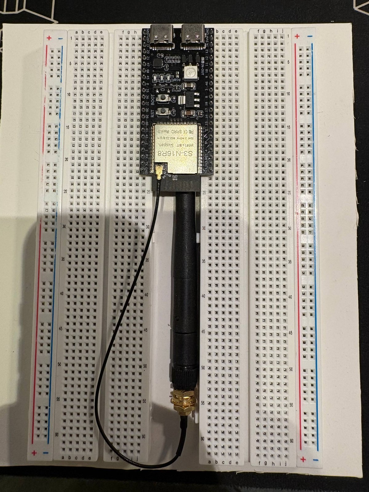

# Hardware

Everything on the bench as of 2026-09-27, identified from the boards themselves. Where a
value comes from a datasheet rather than the board, it says so. Parts stay here after they
are rejected, with the reason.

## Bill of materials

| # | Part | What it is | Role (working assumption) |
|---|------|------------|---------------------------|
| 1 | ESP32-S3-N16R8 devkit (44-pin, dual USB-C, RGB LED, U.FL Wi-Fi antenna) | Controller | Everything: network, I2S in/out, I2C control |
| 2 | GY-PCM5102 (TI PCM5102A) | 32-bit I2S stereo DAC, line out | Audio out from the ESP32 |
| 3 | CJMCU-4713 (Silicon Labs Si4713) | FM stereo transmitter with RDS, I2C | Puts the audio on the FM band for ordinary radios |
| 4 | INMP441 round module | Omnidirectional I2S MEMS microphone | Audio in |
| 5 | LM2596S-ADJ buck module with 3-digit voltmeter | Adjustable step-down, 4–40 V in | Powers the bench from one supply |

Nothing in this list amplifies or drives a speaker, which is what makes the FM-transmitter
reading of the project the likely one: the ESP32 receives or produces audio, the DAC turns it
into a line-level signal, the Si4713 puts it on the air, and every FM radio in the flat is a
speaker. The microphone is the open question, see below.

## 1. ESP32-S3-N16R8 devkit

The same board family as the bastion project: ESP32-S3 module with 16 MB flash and 8 MB
octal PSRAM, two USB-C ports (one UART bridge, one native USB OTG), WS2812 RGB LED, BOOT
and RST buttons, 2×22 header. On this unit the module has a U.FL connector and an external
2.4 GHz whip antenna on a pigtail; that is the Wi-Fi antenna, not the FM one.

It straddles two breadboards so that every pin has four free holes on its side.

Header as printed on the board, top to bottom:

- left: GND, GND, 19, 20, 21, 47, 48, 45, 0, 35, 36, 37, 38, 39, 40, 41, 42, 2, 1, RX, TX, GND
- right: 5Vin, GND, 14, 13, 12, 11, 10, 9, 46, 3, 8, 18, 17, 16, 15, 7, 6, 5, 4, RST, 3V3

Pins that are not free on an N16R8:

- **GPIO35, 36, 37** — octal PSRAM. Never touch them.
- **GPIO19, 20** — native USB D-/D+. Keep them for USB unless USB is given up deliberately.
- **GPIO0, 3, 45, 46** — strapping pins. Fine as outputs after boot, bad as inputs with pull-ups.
- **GPIO43, 44** — UART0 (RX/TX on the header), the console.

What the S3 gives this project and what it does not:

- Two I2S controllers, so the DAC (TX) and the microphone (RX) run independently with their
  own clocks. The S3 has no internal DAC, which is why an external one is here.
- Native USB OTG: the board can enumerate as a USB audio device (TinyUSB UAC2), which makes
  a "USB sound card that broadcasts on FM" possible without Wi-Fi at all.
- **No Bluetooth Classic.** The S3 is BLE only, so it cannot be an A2DP sink. If the plan was
  "Bluetooth speaker on FM", that needs a classic ESP32 or a different source path (Wi-Fi
  stream, USB audio, SD card, internet radio).

## 2. GY-PCM5102 — I2S DAC

TI PCM5102A: 32-bit, up to 384 kHz, 2.1 Vrms line output, no MCLK needed (internal PLL from
BCK). The module has its own two LDOs (digital and analog 3.3 V, the A3V3 pin is the analog
one), a 3.5 mm jack and L/G/R/G pads for the line out. It runs from 5 V on VIN.

Front header: SCK, BCK, DIN, LCK, GND, VIN.

**SCK.** The header pin is the master clock input. With no MCLK from the ESP32 it must be tied
to GND, otherwise the PLL does not lock and the DAC stays silent. Next to the SCK label there
is a pair of solder pads for exactly that bridge; on this unit they look open, so either
bridge them or ground the SCK pin on the wire. Alternative: the S3 can output MCLK on a GPIO;
not needed for this DAC.

**Configuration jumpers** on the back (H = high, L = low; the pad in the middle is the pin):

| Jumper | Pin | L | H | Expected factory setting |
|--------|-----|---|---|--------------------------|
| H1L | FLT | normal latency FIR | low-latency IIR | L |
| H2L | DEMP | de-emphasis off | de-emphasis on (44.1 kHz) | L |
| H3L | XSMT | **muted** | unmuted | H |
| H4L | FMT | I2S | left-justified | L |

The four positions are populated on this board, but which side each blob sits on cannot be
read from the photo. **Verify all four with a meter before the first power-up**; H3L on the
L side is the classic reason a brand-new GY-PCM5102 "does not work".

Other things seen on the board: a 22 Ω series resistor on DIN (printed 220), the usual output
RC filter (470 Ω, 2.2 nF class) near the jack.

## 3. CJMCU-4713 — Si4713 FM transmitter

A clone of the Adafruit Si4713 breakout (Adafruit #1958), same pinout:

`RST, CS, SCL, SDA, GP1, GP2, 3Vo, GND, VIN, LIN, RIN` on the header, a 3.5 mm jack that is
wired in parallel with LIN/RIN as the audio input, a 32.768 kHz crystal (the chip's reference),
an on-board 3.0 V LDO (3Vo pin) and a single **Ant** pad for a wire antenna. VIN takes 3–5 V.

- I2C, 7-bit address **0x63** with CS high (the default on the Adafruit design), 0x11 with CS
  low. RST must be driven low then high after power-up; the chip does nothing until then.
- 76–108 MHz, stereo, RDS/RBDS, pre-emphasis 50 µs (Europe) or 75 µs, audio input at line
  level (nominal 190 mVpk into LIN/RIN; the DAC's 2.1 Vrms is far above that, so either a
  divider or the DAC's digital volume is needed).
- Output power register 88–115 dBµV, plus antenna tuning capacitor. A quarter-wave wire for
  ~100 MHz is about 75 cm; the Adafruit guide uses a ~1 m wire.
- GP1/GP2 are spare GPIOs of the chip; the chip also has an RDS/ASQ interrupt.

**Regulatory note, recorded so it is not forgotten.** In the EU, licence-free FM transmission in
87.5–108 MHz is limited to 50 nW e.r.p. (ERC/REC 70-03, Annex 13). Even the Si4713's minimum
setting with a real antenna is above that, and the Adafruit board is sold as a development
tool, not a certified transmitter. Whatever the project becomes, the transmit power should
stay at the minimum that reaches the radios in the flat, the antenna as short as works, and
the frequency an empty one. Where this project runs is not in the repository.

## 4. INMP441 — I2S microphone

Round black module, ~10 mm, bottom-port MEMS (the hole in the centre of the board is the
acoustic port; do not cover it). Header: `L/R, WS, SCK, SD, VDD, GND`. On the back a single
capacitor and a 10 Ω (printed 010) series resistor on VDD.

- 24-bit I2S, 61 dBA SNR, flat 60 Hz–15 kHz, VDD 1.8–3.3 V (**3.3 V, not 5 V**).
- L/R to GND puts the data in the left slot, to VDD in the right slot. Two microphones can
  share one bus that way.
- On the ESP32 it reads as 32-bit slots with 24 valid bits, left-aligned; sign-extend from
  bit 31 and shift, do not treat it as 32-bit audio.

Why a microphone is here is not settled. Candidates: an intercom/announcement path (speak
into the ESP32, hear it on the radios), a room-level meter that ducks the broadcast, wake-word
control, or plain bench characterisation of the room. Decide in `decisions.md`.

## 5. LM2596S-ADJ buck module with voltmeter

The common "LM2596 DC-DC with LED display" board: LM2596S-ADJ, 100 µF/50 V input
electrolytic, 33 µH shielded inductor (printed 330), SS34 Schottky, 50 kΩ multi-turn trimmer
(R5, 503), two screw terminals, three-digit voltmeter with two buttons that switch the display
between IN and OUT voltage.

- Input 4–40 V, output 1.25–37 V (set it lower than input by at least ~1.5 V), 2 A continuous,
  3 A with a heatsink. Switching at ~150 kHz.
- Set the output with nothing connected, confirm with a meter, only then connect the ESP32.
  The trimmer turns many times; the display is a guide, not a calibration.
- Its output ripple is tens of mV. That is fine for the ESP32's 5Vin and for the DAC and
  Si4713 boards, which regulate again on-board, but do not feed it straight into anything
  analog without an LDO in between.

Power budget from the datasheets: ESP32-S3 with Wi-Fi peaks around 500 mA, PCM5102A ~20 mA,
Si4713 ~20 mA transmitting, INMP441 ~1.5 mA. Under 1 A at 5 V with headroom.

## Draft wiring (not yet wired)

A first allocation that avoids the reserved pins above and keeps the two I2S buses and the
I2C bus in separate regions of the header. Change it freely; when it is wired, this table
becomes the truth and gets its own commit.

| Function | ESP32-S3 GPIO | Module pin |
|----------|---------------|------------|
| I2S0 TX bit clock | 12 | PCM5102 BCK |
| I2S0 TX word select | 11 | PCM5102 LCK |
| I2S0 TX data | 10 | PCM5102 DIN |
| — | GND | PCM5102 SCK |
| I2S1 RX bit clock | 16 | INMP441 SCK |
| I2S1 RX word select | 17 | INMP441 WS |
| I2S1 RX data | 18 | INMP441 SD |
| — | GND | INMP441 L/R |
| I2C SDA | 8 | Si4713 SDA |
| I2C SCL | 9 | Si4713 SCL |
| Si4713 reset | 4 | Si4713 RST |
| — | 3V3 | Si4713 CS (address 0x63) |
| Audio | PCM5102 L/R/G line out | Si4713 LIN/RIN/GND |

Power: buck set to 5.0 V → ESP32 5Vin, PCM5102 VIN, Si4713 VIN. INMP441 VDD from the
ESP32's 3V3 pin. One common ground; keep the microphone's ground wire short and away from
the buck.

## Photos

The breadboard photo above is in the repository. The close-ups of the modules were taken in
hand and show fingerprints at a resolution where the ridges are legible; that is biometric
data and stays out of a repository that will be public. Retake them on the bench when the
boards are wired.
